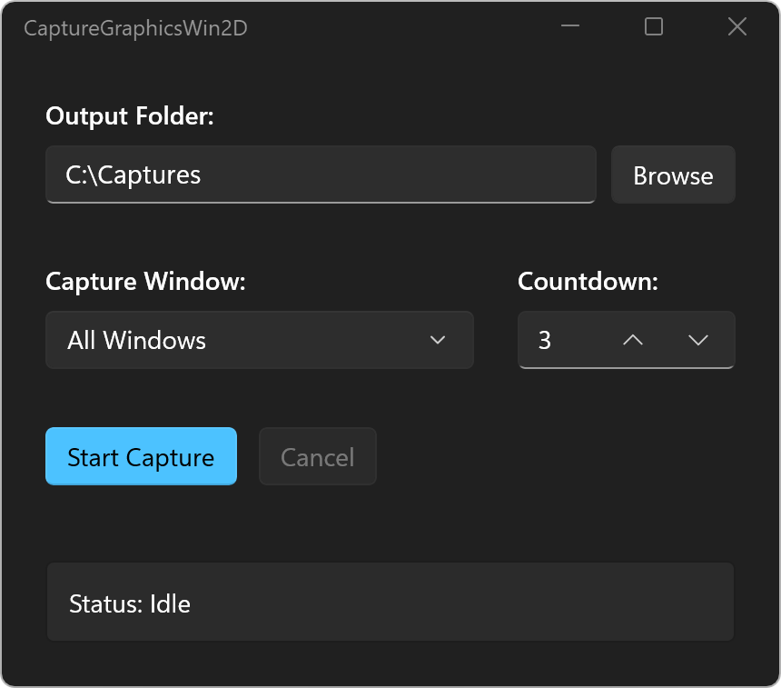
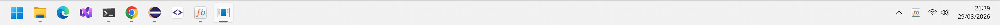
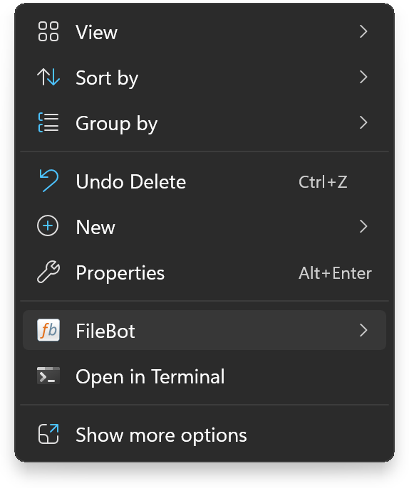
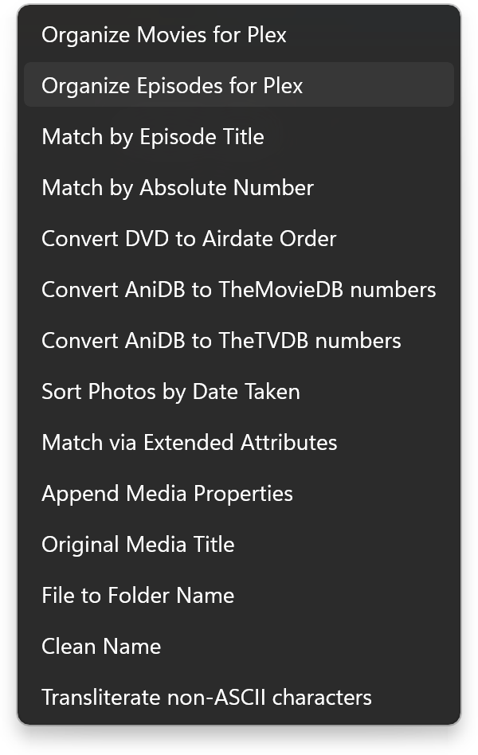
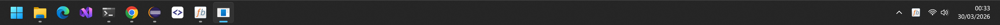

# CaptureGraphicsWin2D
`CaptureGraphicsWin2D` is a simple screenshot tool for Windows 11 that uses the `Microsoft.Graphics.Win2D` API to capture windows with alpha channel and save them as PNG.


This allows you to correctly **capture windows with transparency**:
* windows with rounded borders
* windows with shadows (e.g. context menu)
* windows with transparent surfaces (e.g. taskbar)

Download:
* [CaptureGraphicsWin2D 1.0 for x64](https://github.com/rednoah/CaptureGraphicsWin2D/releases/download/1.0/CaptureGraphicsWin2D_x64.zip)
* [CaptureGraphicsWin2D 1.0 for ARM64](https://github.com/rednoah/CaptureGraphicsWin2D/releases/download/1.0/CaptureGraphicsWin2D_arm64.zip)

Video:
* [Screenshot Tool for Windows 11 - CaptureGraphicsWin2D - YouTube](https://www.youtube.com/watch?v=aWMvMo0-vAs)




# Command-Line Usage
e.g. capture all windows
```bash
CaptureGraphicsWin2D "C:\Captures"
```
e.g. capture a given window
```bash
CaptureGraphicsWin2D "C:\Captures" "Shell_TrayWnd"
```


# Motivation
I was not able to find a screenshot tool that was able to capture the Windows 11 Files context menu / Windows 11 Taskbar / etc with alpha channel for transparency.






